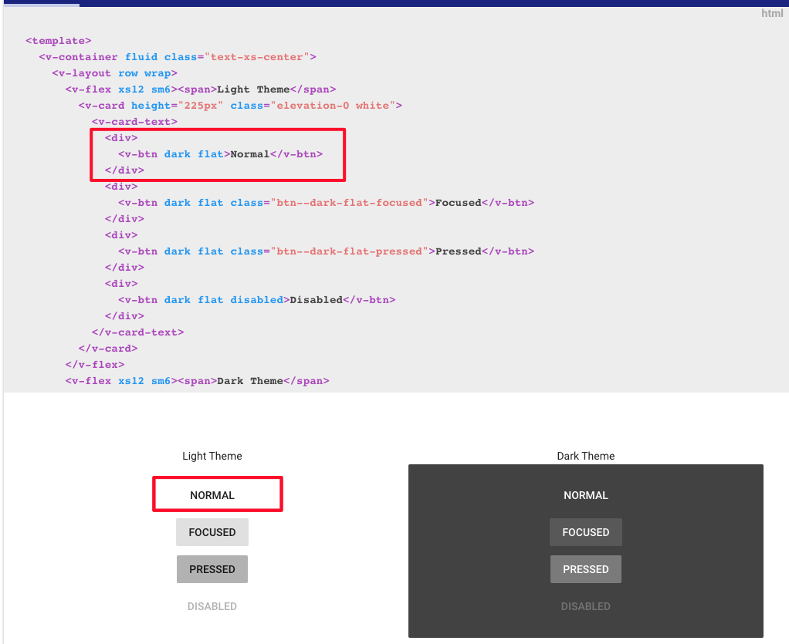

# 使用 Material Design UI 开发

`Material Design UI` 是指基于 Google 的 Material Design 全新设计语言的一些功能非常强大，界面却十分清新简洁、美观，交互更加立体友好的`CSS框架`。它们提供了很多常用的UI组件，除了最基本的菜单、按钮、滑动杆、进度条、单选框/复选框外，另外还提供了一些很有趣的图标、layouts、主题等。结合这些组件库的使用，我们能够快速搭建出一个强大、美观的网站展现效果。既然有了，为啥不用呢？其中基于 Vuejs 2.0 和 Material Design 的 UI 库也很多（[点击查看](https://www.awesomes.cn/subject/vue#Dom-框架)），如 [muse-ui](http://www.muse-ui.org/#/index)、[vue-material](http://vuematerial.com/#/)、[vuetify](https://vuetifyjs.com/) 等，导出项目中选用了 vuetify 组件库。


## [Vuetify](https://vuetifyjs.com) 介绍及使用

### 介绍

结合 Material 和 Vue 建立精美的app应用应用，提升用户的交互体验。官网也给出了该框架的一些优势：

* 轻量级，考虑到了 SSR (server side rendered)服务端渲染的情况，这也是我们选择它的原因之一

* Layouts 结合 Material Design，提供了对无二的交互体验，满足您的开发需求

* 提供很多可用的组件，使用方便


### 安装 Vuetify 通过 npm 或 yarn:

> $  npm install vuetify --save-dev
> $  yarn add vuetify --dev

### 使用

启用 Vuetify 在你的应用（项目中对应`src/app.js`）中通过 Vue.use()导入即可，使用比较方便:


```js
// 引入全部组件
import Vue from 'vue'
import Vuetify from 'vuetify'

Vue.use(Vuetify)

```



可以在官网查看更多组件的使用和效果

### 导出项目[修改主题](./06-how-to-change-theme.md)
项目中修改主题的配置在 `config/theme.js` 中，详细可点击上面链接查看，此处不多赘述


## 不使用 Material Design UI?

Material Design UI 库的运用可以让我们快速的实现一些美观的展现效果，但是如果官网提供的效果仍然没有符合您的预期，您也可以自己开发自己的组件，应用到自己的项目中。


### 开发组件

这里以一个简单的 mask 蒙层组件为例


* 组件的开发：

```html
<!-- 模板部分： 点击蒙层调用关闭方法 -->
<template>
    <transition name="fade">
        <div
            v-show="show"
            v-bind:class="[{'app-mask-show': show}, 'app-mask-wrapper']"
            @click.stop="closeAppMask">
        </div>
    </transition>
</template>

<!-- js部分：包括需要父组件传递来的一些参数props,和本身方法methods -->
<script>
export default {
    props: ['show'],
    methods: {
        closeAppMask() {
            this.$emit('close-mask');
        }
    }
};
</script>

<!-- 样式效果 -->
<style lang="stylus" scoped>...</style>
```

* 父组件如何调用：

```html

<template>
    <div class="app-sidebar-wrapper">
        <!-- 使用app-mask组件，注意使用时驼转化成中划线-->
        <app-mask
            :show="show"
            @close-mask="closeAppSidebar"
        ></app-mask>

    </div>
</template>

/* 通过 import 引入组件，放到components中，在模板中就可以调用啦 */
<script>
import AppMask from './AppMask.vue';

export default {
    components: {
        AppMask
    },
    props: {
        show: {
            type: Boolean,
            default: true
        }
    },
    methods: {
        closeAppSidebar() {
            this.$emit('close-sidebar');
        }
    }
};
</script>

/* 样式 */
<style lang="stylus" scoped>...</style>
```
