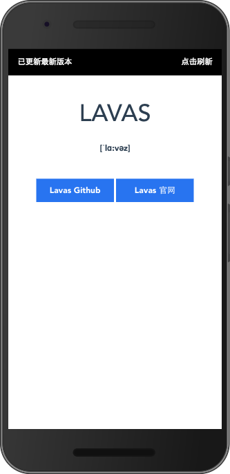

# 维护 service-worker.js 文件

开始之前，您可以查看 [Service Worker](https://lavas.baidu.com/doc/offline-and-cache-loading/service-worker/service-worker-introduction) 相关内容，快速掌握相关基础。查看 Service Worker [浏览器支持情况](http://caniuse.com/#feat=serviceworkers)

service-worker.js 文件作为缓存管理的重要文件，在导出 Lavas 工程的时候我们默认给了一个能覆盖缓存需求的 `/dist/service-worker.js` 文件。
但是我们默认提供的文件可能在后续您的开发过程中并不能完全覆盖您的需求，所以你需要对其进行一定的维护。

## service-worker.js

导出项目中，使用了 [Service Worker](https://developer.mozilla.org/en-US/docs/Web/API/Service_Worker_API) + [sw-precache](https://github.com/GoogleChrome/sw-precache) + [sw-precache-webpack-plugin](https://www.npmjs.com/package/sw-precache-webpack-plugin) (Webpack 插件) 的方式，仅在 build 后自动生成可见的 `service-worker.js` 文件，该文件有如下特征：

* 支持离线缓存静态资源能力

* 通过配置实现动态网络请求和静态资源文件的缓存和更新机制

* 支持 `service-worker.js` 文件更新时，页面提示更新重载。

如果开发者没有特殊的缓存需求，可直接使用。如果开发者需要后续工程的定制化，就要再深入了解以下几方面内容：


## 如何配置缓存内容

开发者可通过 `config/sw-precache.js` 文件进行缓存配置，根据配置为用户缓存网站静态与动态资源，并截获用户的所有网络请求，决定是从缓存还是网络获取相应资源，限制缓存大小等。对于无额外需求的开发者，一般仅需配置该文件就可满足项目需求，不配置默认缓存所有静态资源。

下面来看一下，具体配置结构（此处给出了一些常用配置，更全面的配置可通过 [sw-precache](https://github.com/GoogleChrome/sw-precache) 查看），该配置在 `webpack.prod.conf.js` 中被 [sw-precache-webpack-plugin](https://www.npmjs.com/package/sw-precache-webpack-plugin) 组件作为参数引入，build 时起作用，生成定制化 `service-worker.js` 文件。


```js
/* sw-precache.js中的配置 */

build: {

    cacheId: 'my-vue-app',

    // 生成的文件名称
    filename: 'service-worker.js',

    // 需缓存的文件配置, 可以逐项添加, 需动态缓存的放到runtimeCaching中处理
    staticFileGlobs: [
        // 'dist/index.html',
        // 'dist/static/**/**.*'
    ],

    // webpack生成的静态资源全部缓存
    mergeStaticsConfig: true,

    // 忽略的文件
    staticFileGlobsIgnorePatterns: [
        /\.map$/ // map文件不需要缓存
    ],

    // 需要省略掉的前缀名
    stripPrefix: 'dist/',

    // 当请求路径不在缓存里的返回，对于单页应用来说，入口点是一样的
    navigateFallback: '/index.html',

    // 白名单包含所有的.html (for HTML imports) 和路径中含 `/data/`
    navigateFallbackWhitelist: [/^(?!.*\.html$|\/data\/).*/],

    // 是否压缩，默认不压缩
    minify: true,

    // 最大缓存大小
    maximumFileSizeToCacheInBytes: 4194304,

    // 生成service-worker.js的文件配置模板，不配置时采用默认的配置
    // 本demo做了sw的更新策略，所以在原有模板基础做了相应的修改
    templateFilePath: 'config/sw.tmpl.js',

    verbose: true,

    // 需要根据路由动态处理的文件
    runtimeCaching: [
        // 如果在staticFileGlobs中设置相同的缓存路径，可能导致此处不起作用
        {
            urlPattern: /\/fonts\//,
            handler: 'networkFirst',
            options: {
                cache: {
                    maxEntries: 10,
                    name: 'fonts-cache'
                }
            }
        }
    ]
}


// webpack.prod.conf.js 中通过组件引入配置，生成文件
new SWPrecacheWebpackPlugin(config.swPrecache.build);
```

> 更加详细的内容，可以参考 [sw-precache-webpack-plugin](https://www.npmjs.com/package/sw-precache-webpack-plugin) 了解详情。

## 如何修改 service-worker.js 文件内容

**1、若自动生成的文件无法满足需求，如何进行定制化开发?**

我们先要了解 sw-precache 工具是怎么生成了这个 `service-worker.js` 文件。
要让 sw-precahce 工具生成 `service-worker.js` 文件，需要给它提供一个模板文件。
工具默认使用插件默认模板，但是您也可以定制自己的模板（最好参考默认模板），通过配置 templateFilePath 导入模板，实现定制化开发。在上面文件示例中，是通过 `templateFilePath: 'config/sw.tmpl.js'` 导入定制化模板来生成 `service-worker.js` 文件。Lavas 导出项目中默认将导入模板文件放在 `config/sw.tmpl.js` 下，便于开发者后期相应的维护开发。

**2、Lavas 导出项目中做了什么定制化呢 ？**

为了在 `service-worker.js` 文件内容更新时，能够让主页面及时提醒用户更新，我们在 `config/sw.tmpl.js` 文件的 activate 监听事件中通过 postMessage 发送 'sw.update' 字符串，在主页面中，注册了 `onMessage` 消息的监听 (这种方式是 Service Worker 和 主页面进程通信的方式)，一旦接收到 'sw.update' 字符串，主页面给出相应的更新提示。

**注意：** 在首次注册 Service Worker 时不发送更新信息，避免用户在首次进入页面时，就会再次重载，影响用户体验。


```js
// sw.tmpl.js文件中
if (!firstRegister) {
    return self.clients.matchAll()
        .then(function (clients) {
            if (clients && clients.length) {
                var currentClient = clients[0];
                currentClient.postMessage('sw.update');
            }
        });
}
```

## Service Worker 的注册

我们默认在 Lavas 导出工程中引入了 [sw-register-webpack-plugin](https://github.com/lavas-project/sw-register-webpack-plugin)， 该插件专门用来做 service-worker.js 的注册。为了调试方便默认 develop 环境下不会注册 Service Worker, 只有在 production 环境下才会触发构建 `sw-register.js` 入口。

项目的自定义注册部分在项目的 `src/sw-register.js` 文件中，并在项目 build 后在 `dist/index.html` 最后引入执行。上面内容提及的 `service-worker.js` 更新时 'sw.update' 的信息监听和页面重载部分，也是在 `src/sw-register.js` 里完成的，开发者可根据需求做相应的扩展。

```js
// src/sw-register.js 中注册，重载相关代码
navigator.serviceWorker && navigator.serviceWorker.register('/service-worker.js')
    .then(function () {
        // 主页面监听 message 事件
        navigator.serviceWorker.addEventListener('message', function (e) {

            // Service Worker 如果更新成功会 postMessage 给页面，内容为 'sw.update'
            if (e.data === 'sw.update') {

                // 开发者这自定义处理函数，也可以使用默认提供的用户提示，引导用户刷新
                // 这里建议引导用户 reload 处理，详细查看项目具体文件
                // location.reload();
            }
        });
    });
```

```js
// build 后 sw-register-webpack-plugin 会在 index.html 中注入注册代码
window.onload = function () {
    var script = document.createElement('script');
    var firstScript = document.getElementsByTagName('script')[0];
    script.type = 'text/javascript';
    script.async = true;
    script.src = '/sw-register.js?v=' + Date.now();
    firstScript.parentNode.insertBefore(script, firstScript);
};

```

> info
>
> 通过代码可以看出，`sw-register-webpack-plugin` 只是帮助开发者解决 service-worker.js 本身会被 HTTP 缓存的问题，但是我们强行的默认增加了一个 `sw-register.js` 的静态资源请求来保证 `service-worker.js` 永远能够最新。
> 如果服务端能够对 `service-worker.js` 做 no-cache 的处理，则不需要 sw-register-webpack-plugin, 只需要把 `sw-register.js` 中的内容直接写进 `src/app.js`就好了，不用单独请求。

## 动态缓存补充

开发过程中，我们可能会对一些第三方的静态资源或者异步的请求进行动态的 Service Worker 缓存处理，Lavas 导出工程提供了这种动态配置机制：

缓存内容及策略主要通过 `config/sw-precache.js` 配置文件来控制，常用配置的参数如下：

* 配置项中有 `mergeStaticsConfig` 参数（定制化提供参数），默认是 true，即在没配置的情况下，默认缓存所有静态文件

* 如果不想缓存所有的静态文件，需要配置 `staticFileGlobs` 参数，将需要缓存的静态文件，依次写入

* 对于需要动态缓存的资源，可以通过配置文件中的 `runtimeCaching`  参数来配置，此时 sw-precache 模块就会帮我们引入 sw-toolbox 模块。所以在 sw-precache 中使用 runtimeCaching 配置选项可以参考 sw-toolbox 的配置规则，最终动态的路由规则会被添加到 `service-worker.js` 文件的最后。

下面对 runtimeCaching 的具体配置也给出相应的介绍，后期开发应用还是比较广泛的。

例如，下面的配置为两种不同URL模式定义了实时缓存行为。它对两种请求使用不同的处理程序，并为 `/fonts/` 模式相匹配的请求指定了最大可用缓存：

```js
// 需要根据路由动态处理的文件
runtimeCaching: [
    {
        urlPattern: /\/material-design-icon/,
        handler: 'fastest'
    },
    {
        urlPattern: /\/fonts\//,
        handler: 'networkFirst',
        options: {
            cache: {
                maxEntries: 10,
                maxAgeSeconds: 60 * 60 * 30, // 30天有效期
                name: 'fonts-cache'
            }
        }
    }
]
```

runtimeCaching 的配置选项数组中的每个对象都需要一个 urlPattern，它是一个正则表达式或一个字符串，遵循 sw-toolbox 的配置约定。此外，还需要一个 handler，指定其读取动态资源的策略（包括 5 种：networkFirst、cacheFirst、fastest、cacheOnly、networkOnly）。

下面配置相关参数介绍取自[使用指南](https://metaquant.org/programing/sw-precache-guide.html)， 为了您查阅方便直接备注在这里。

**sw-toolbox 提供五种针对网络请求的处理程序( handler )，具体如下：**

* `networkFirst`：首先尝试通过网络来处理请求，如果成功就将响应存储在缓存中，否则返回缓存中的资源来回应请求。它适用于以下类型的API请求，即你总是希望返回的数据是最新的，但是如果无法获取最新数据，则返回一个可用的旧数据。

* `cacheFirst`：如果缓存中存在与网络请求相匹配的资源，则返回相应资源，否则尝试从网络获取资源。 同时，如果网络请求成功则更新缓存。此选项适用于那些不常发生变化的资源，或者有其它更新机制的资源。

* `fastest`：从缓存和网络并行请求资源，并以首先返回的数据作为响应，通常这意味着缓存版本则优先响应。一方面，这个策略总会产生网络请求，即使资源已经被缓存了。另一方面，当网络请求完成时，现有缓存将被更新，从而使得下次读取的缓存将是最新的。

* `cacheOnly`：从缓存中解析请求，如果没有对应缓存则请求失败。此选项适用于需要保证不会发出网络请求的情况，例如在移动设备上节省电量。

* `networkOnly`：尝试从网络获取网址来处理请求。如果获取资源失败，则请求失败，这基本上与不使用 Service Worker 的效果相同。

**sw-toolbox 选项中的 cache 选项可以指定缓存的最大数目以及缓存时间等，具体如下：**

* `cache.name[String]`：用于存储实时缓存对象的缓存名称。使用唯一的名称允许您自定义缓存的最大空间和缓存时间。默认值：在运行时根据 Service Worker 的 registration.scope 值生成。

* `cache.maxEntries[Number]`：对缓存的项目实施 least-recently 缓存过期策略，可以将此项用于动态资源缓存。例如，将 cache.maxEntries 设置为 10 意味着在第 11 个项目被缓存之后，最近最少使用的条目将被自动删除。缓存永远不会超过 cache.maxEntries 规定的最大数量。此选项将仅在同时设置了 cache.name 时生效，它可以单独使用或与 cache.maxAgeSeconds 一起使用。默认值为空。

* `cache.maxAgeSeconds[Number]`：强制规定缓存项目的最大期限（以秒为单位),你可以用这个选项来存储没有自然过期策略的动态资源。例如，可以将 cache.maxAgeSeconds 设置为 60 x 60 x 24，这意味着任何超过一天之前的缓存都将被自动删除。此选项仅在同时设置了 cache.name 时生效，它也可以单独使用或与 cache.maxEntries 一起使用。默认值为空。我们建议设定有效期，如果不设定有效期，一直到 Service Worker 下次安装更新时才会更新该缓存，否则一直生效。

## 缓存更新难题及处理

[查看 Service Worker 版本更新相关](https://lavas.baidu.com/doc/offline-and-cache-loading/service-worker/how-to-use-service-worker#service-worker-版本更新)

了解 Service Worker 基本的更新机制，Lavas 导出项目中默认主要解决了两个问题：

* 当发布了新版本代码，怎么保证能拿到最新的 `service-worker.js` 文件，而不是从缓存中读取。如果 `service-worker.js` 不能及时更新，Service Worker 内的缓存的文件就不能更新，项目中怎么解决呢？

我们在 `sw-rigester.js` 的请求中增加了一个时间戳参数[可参考上文示例](./service-worker-maintenance#service-worker-的注册)，保证每次 `sw-rigester.js` 文件请求都获取最新的 `sw-register.js` 文件，且其中被注册的 `service-worker.js` 文件请求也带有最新的版本参数，保证每次 `service-worker.js` 文件请求的都是最新版本。您可在 build 后，在 `dist/index.html` 文件最后查看时间戳相关代码，包括版本参数等都是由 `sw-register-webpack-plugin` 插件完成，无需修改。

* 当 `service-worker.js` 文件更新后，打开的旧页面并不能及时感知，要重新加载时才能得到更新，这在新版本上线时很容易导致出现问题，所以我们希望在 `service-worker.js` 检测到版本更新，重新安装后能够及时的通知主页面（这里不包括首次安装的情况），并做出相应的处理，项目中默认提示页面更新，进行 reload 处理（`src/sw-register.js`），您也可以开发扩展，如改为弹层交互，告知用户有新版本，需要重载更新等。

> info
>
> 我们虽然提供了缓存及时更新的方案，但还是推荐使用服务器对 `service-worker.js` 做 no-cache 处理。



## Service Worker 容错降级方案

由于 Service Worker 的持久离线本地缓存的能力，能力越大风险越大。我们在设计 Service Worker 的时候需要考虑容错降级机制。推荐的做法是采取开关控制模式。这样可以及时全面的控制风险。

```javascript
if (navigator.serviceWorker) {
    fetch(开关的异步接口)
        .then(function (status) {
            if (status 是 表示降级处理) {
                // 注销所有已安装的 Service Worker
            }
            else {
                // 注册 Service Worker
            }
        });
}
```

要注意的有几点：

* 降级一定要注销掉 Service Worker ，而不是简单地不安装。这是因为降级前可能已经有用户访问过网站，导致 Service Worker 被安装，不注销的话降级开关对这部分用户是不起作用的。
* 降级开关需要有即时性，因此服务器和 Service Worker 以及浏览器 http 缓存都不应该缓存该接口。
* 降级开关异步接口如果条件允许的话最好走配置配送上线，遇到紧急问题，快速上线才是王道。
* 出现问题并降级后，可能影响问题的排查，因此可以考虑加入对用户隐蔽的 debug 模式（如 url 传入特定字段，debug 模式中忽略降级接口。

## 小结

了解上面的这些内容之后，大家可以通过 Lavas 快速导出一个项目，轻松的完成 Service Worker 调试啦
