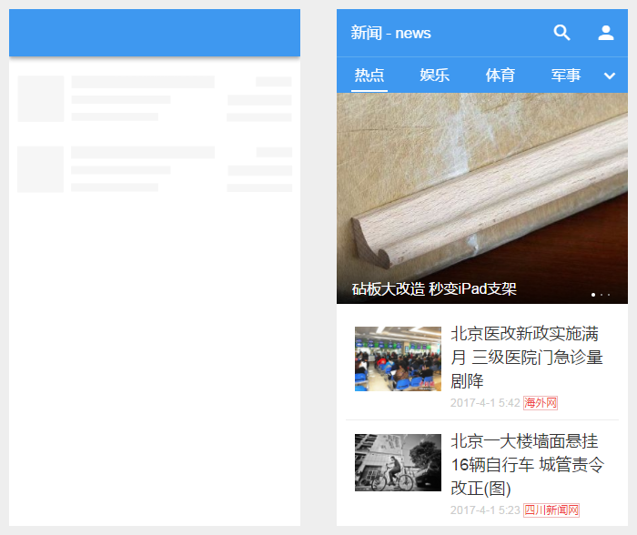

# App Skeleton 介绍

在使用 Native APP 时我们经常可以看到在实际内容加载出来之前会有一些“占位图片”，因为其结构和实际加载内容相似(如新闻页面加载之前也会有一个纵向列表)，因此让用户感知到自己的页面正在加载中，体验较好。而传统的WEB站点因为无法实现这一点，在加载前统一为白屏，我们能优化的仅仅是缩短这个“白屏时间”，这就决定了 WEB APP 相较于 Native APP 在用户体验上的先天劣势。

我们把这个“占位图片”称为 `skeleton` 。通过 PWA 的缓存机制，我们现在已经有能力让 skeleton 也出现在 WEB APP 上取代白屏。在了解具体细节之前，我们先观察一个由 lavas 生成的示例的效果图。



受 [Ele.me 升级至 PWA](http://geek.csdn.net/news/detail/210535) 一文启发，我们采取的实现方法大致是：

1. 在构建时将一个固定的 skeleton 路由组件的渲染结果插入 HTML 模版中
2. 在 service worker 中配置其对包含 skeleton 的 HTML 进行缓存
3. 页面切换时直接读取缓存获取包含 skeleton 的 HTML，大大缩短甚至去除白屏时间

## lavas 的 skeleton 支持

以提升 WEB APP 用户体验为核心的 PWA 自然应该将 skeleton 纳入考虑范围，因此 lavas 也将 skeleton 的支持集成到所有初始化的项目中(不论选择的是哪种模板)。因此生成的项目在切换页面时会率先渲染 skeleton ，效果会是这样：


这里还需要注意一点：skeleton 会在页面首次进入时出现。在单页应用情况下( [Lavas Basic 模版](https://github.com/lavas-project/lavas-template-vue-basic)和 [Lavas App Shell 模版](https://github.com/lavas-project/lavas-template-vue-appshell))，因为后续页面切换均由 Vue 在前端完成，因此 skeleton 只会在第一次进入页面时展现。而在多页应用情况下( [Lavas MPA 模版](https://github.com/lavas-project/lavas-template-vue-mpa))，lavas 支持为每个页面都提供一个 skeleton ，因此在每个页面之间切换都会有目标页面对应的 skeleton 展现。

### 默认 skeleton

首先需要指出一个大原则：lavas 的每个模板都__已经__帮助开发者设置了默认的 skeleton ，__不需要开发者进行任何额外的配置即可生效__。所以以下部分仅供需要了解 skeleton 配置和运行方式，或者希望对其进行修改的开发者参考。如果你想直接使用默认的 skeleton ，你也可以选择略过这部分。

### 代码位置和路由规则

在通过 lavas 初始化的项目中，skeleton 是以 Vue 组件的形式存在的。以 Basic 模板为例，skeleton 位于 `pages/Skeleton.vue` 。我们可以通过路由规则 `/skeleton` 在开发模式下访问到这个组件。如果用户需要根据实际项目的不同需求(如需要区别于纵向排列的其他 skeleton )，也可进行修改并通过路由规则预览并确认效果。__另外开发者也不用担心，在构建后的生产模式代码中是不会包含这条路由规则的。__多页应用有多个 skeleton ，因此路由规则会包含每个页面，详情可见[多页应用的模板介绍]()

### 运行方式

我们为 skeleton 开发了一个 webpack 插件：[vue-skeleton-webpack-plugin](https://github.com/lavas-project/vue-skeleton-webpack-plugin)。在生成的项目中，我们对它进行了如下配置：

1. 在开发环境时，我们在 `build/webpack.dev.conf.js` 中配置 `module.rules` , 将 `/skeleton` 添加到路由规则

    ```javascript
    module.exports = merge(baseWebpackConfig, {
        module: {
            rules: utils.styleLoaders({sourceMap: config.dev.cssSourceMap})
                .concat(SkeletonWebpackPlugin.loader({
                    entry: 'skeleton',
                    routerEntry: resolve('src/router.js')
                }))
        },
        ...
    })
    ```

2. 在开发环境的配置文件 `build/webpack.dev.conf.js` 和生产环境的配置文件 `build/webpack.prod.conf.js` 中配置 `plugins` 数组，将 skeleton 的全部内容添加到 HTML 中，从而展现效果

    ```javascript
    module.exports = merge(baseWebpackConfig, {
        ...
        plugins: [
            ...
            new SkeletonWebpackPlugin({
                webpackConfig: require('./webpack.skeleton.conf')
            }),
            ...
        ]
    })
    ```

在实际运行中，skeleton 的展现和消失有如下几个步骤：

1. 调用 `ssr` (依赖于`vue-server-renderer`，详见[这里](https://ssr.vuejs.org/zh/)) 对 skeleton 的 Vue 组件进行服务端渲染，保存渲染完成的内容(包含 skeleton 的所有 HTML 和 CSS )
2. 根据 webpack plugins 的配置，在 webpack 编译(`compilation`)并捕获到事件`html-webpack-plugin-before-html-processing`时 (这个事件由`html-webpack-plugin`抛出，关于这个常用插件的介绍请看[这里](https://github.com/jantimon/html-webpack-plugin)) 对编译过程中的 HTML 进行操作
3. 寻找编译过程中的 HTML 的 Vue 挂载根节点，一般是`<div id="app">`。将上述渲染完成的 skeleton 内容插入到这个节点内部
4. 在用户进入页面时，因为 HTML 中已经包含了 skeleton 渲染完成的内容，因此可以直接展现。而当 Vue 加载完成后进行挂载(mount)时，挂载根节点内的 skeleton 内容会被替换，从而完成 skeleton 使命
5. 在 service worker 中配置其对 skeleton HTML 进行缓存，下次直接从缓存返回结果

### lavas SSR 模板和 skeleton

在使用服务端渲染时，由于服务端返回的 HTML 已经包含了首屏的页面结构，并不需要客户端渲染首屏内容，此时 skeleton 就没有存在的必要了，可参考我们的 [Lavas SSR 模版](https://github.com/lavas-project/lavas-template-vue-ssr)。

### 一些注意点

1. 由于 skeleton 中包含的代码和样式都会内联在最终的 HTML 中，所以应该尽可能保持 skeleton 结构和样式的精简。如无必要，尽量不要在 skeleton 中使用第三方UI组件(如 materialUI, Vuetify等)，这会导致输出大量样式规则。

2. Skeleton.vue 中已经引入了 [normalize.css](https://github.com/necolas/normalize.css/)，这就意味着在全局样式或者其他组件中都不需要重复引入了。

3. 虽然 skeleton 本身也是个 Vue 控件，但因为采用了服务端渲染，因此省略了很多声明周期，只有 `beforeCreate` 和 `create` 会被调用。此外我们也应当避免在这两个周期钩子函数中使用全局代码，如 `setInterval` 等等。详细情况可以参考[Vue官网关于SSR的介绍](https://ssr.vuejs.org/zh/universal.html)
