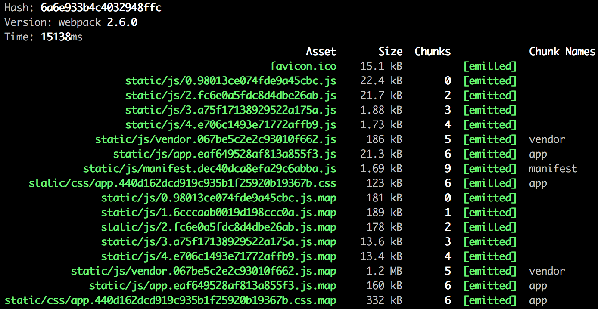

# 构建部署工程

和其他基于 vue 模版项目一样，构建和部署都十分简单。

## 生产环境构建

生产环境构建出的所有静态资源默认输出在 `/dist` 文件夹下。

```npm
$ npm run build
```

执行命令后，在控制台的输出主要分成两部分，第一部分是 sw-precache 缓存的静态资源列表。


第二部分就是 vue 模版项目通用的最终生成的静态资源列表。


## 部署到服务器

由于 Lavas 导出模版中项目默认使用了 vue-router 的 `HTML5 History` 模式（而非采用 hash 模式），我们还需要做一些服务器端的配置。

### Nginx 配置

（1）为了避免在单页面项目中出现 404 情况，就要保证将所有 URL 指向 `index.html`，服务器端需要进行这一配置（目前的 basic、AppShell 模板均为单页项目）。以 nginx 为例，安装好 nginx 后，可以在 `nginx.conf` 文件中增加一个 server, 配置好端口，启动项目路径 root (即 build 后的 dist 文件夹地址)，配置下面的 location，启动 nginx 即可。

```js
listen       8848;
server_name  localhost;
root /users/eral/workspace/pwa-shell/dist/;

location / {
    try_files $uri $uri/ /index.html;
}
```

> 注意
>
> 这么做以后，你的服务器就不再返回 404 错误页面，因为对于所有路径都会返回 `index.html` 文件。为了避免这种情况，可以在 Vue 应用里面最后覆盖所有的路由情况，然后给出一个 404 页面。

```js
const router = new VueRouter({
    mode: 'history',
    routes: [
        {
            path: '*',
            component: NotFound
        }
    ]
})
```

(2) 同理，多页项目模板中，我们需要在后端服务器配置多个路由指定到不同的页面(即 mpa 模板)，才能正常的访问多页。同样以 nginx 为例，可以在 `nginx.conf` 文件中配置多条 location，其他同上，启动 nginx 即可。

```js
listen       8848;
server_name  localhost;
root /users/eral/workspace/pwa-shell/dist/;

location /home {
    try_files $uri $uri/ /home.html;
}

location /detail {
    try_files $uri $uri/ /detail.html;
}

location /search {
    try_files $uri $uri/ /search.html;
}
```

> 注意
>
> 同理，服务器不再返回 404 错误页面，因为对于不同路径会返回指定 html 文件。为了避免这种情况，可以在 Vue 应用里面覆盖所有的路由情况，判断非有效路由后给出一个 404 页面。不过这里需要注意的是，在多页的跳转中，判断非本页路由后，不能直接返回 404 页面，而是还需先判断是否为其他页面的有效路由，如果是直接跳转至其他页面，如果不是才能返回 404 页面。

```js
const router = new VueRouter({
    mode: 'history',
    base: '/',
    routes: [
        {
            path: '*',
            component: NotFound,
            beforeEnter(to, from, next) {
                if (validateRoute(to.fullPath)) { // 如是其他页面有效路由则跳转
                    window.location.href = to.fullPath;
                    return;
                }
                next(); // 非有效路由继续展示404页面
            }
        }
    ]
})
```


### Node.js (Express)

在 Lavas 导出的模板中，在开发模式下就是采用的 Express 的配置方式，所以具体可以参考 `build/dev-server.js` 中的处理方法来处理，主要是利用了 [connect-history-api-fallback 插件](https://github.com/bripkens/connect-history-api-fallback)，如果您是在线上环境中使用，也需要服务器做相应处理

（1）单页项目模板中，默认都指向 `index.html`

```js
// 处理 history API 的回退情况
app.use(require('connect-history-api-fallback')());
```

（2）多页项目模板中, 需要我们配置多个路径，通过 rewrite 参数传入，将不同路由指向不同的页面入口

```js
// 处理HTML5 history API，映射例如/home路由到/home/index.html
let rewrites = Object.keys(utils.getEntries('./src/pages', 'entry.js'))
    .map(function (entry) {
        return {
            from: new RegExp('/' + entry),
            to: '/' + entry + '/index.html'
        };
    });

app.use(require('connect-history-api-fallback')({
    htmlAcceptHeaders: ['text/html'],
    rewrites: rewrites
}));
```

具体配置可参考 [vue-router 官方文档中 Apache，nginx 和 Express 的配置](https://router.vuejs.org/zh-cn/essentials/history-mode.html)。

