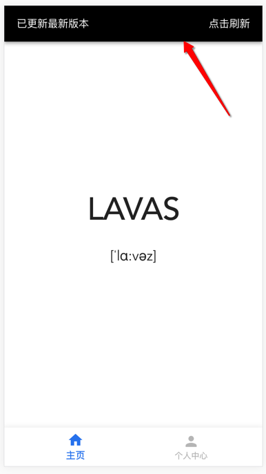
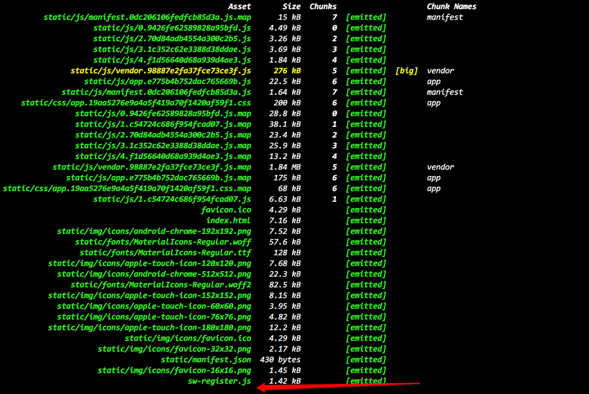

# sw-register-webpack-plugin 插件

> 一个 webpack 插件，解决 service-worker.js 的注册和更新问题。
> Lavas 解决方案默认集成该插件用来实现 Service Worker 文件的注册及缓存更新机制，默认只在 build 生产环境下构建生效。
>
> github: [https://github.com/lavas-project/sw-register-webpack-plugin.git](https://github.com/lavas-project/sw-register-webpack-plugin.git)

## 背景

PWA 工程需要注册 `service-worker.js`，`service-worker.js` 通过注册，安装，激活等系列步骤后，会对当前页面的静态资源和静态页面等资源进行持久缓存。

如果在 web 站点上线之后运行了一段时间之后，需要进行第二次上线的话，我们预期的是将 Service Worker 文件替换成最新上线的文件，将所有被缓存的资源都替换成新上线的资源，并且用户能够即时的更新我们新上线的内容。

这个时候问题就显现出来了，再讨论具体问题之前首先我们需要明确以下事情：

- 浏览器会 diff 当前打开页面的 `service-worker.js`，并判断是否更新，如果 diff 结果为更新，则重新安装最新的 `service-wroker.js`，并且全量更新缓存
- 任何静态资源包括 `service-worker.js` 都会被 HTTP 缓存
- 服务器对某个资源进行 `no-cache` 设置可以避免 HTTP 缓存

通常我们仅仅在页面的某个 `<script></script>` 中或者页面的某个 `xxx.js` 中以下面这种方式实现 Service Worker 文件注册。

```js
if (navigator.serviceWorker) {
    navigator.serviceWorker.register('/service-worker.js', {scope: '/'}).then(function () {
        // balabala
    });
}
```

通过这段代码，`service-worker.js` 文件确实是可以被注册成功，如果这个 `service-worker.js` 中有对静态资源的缓存的话也会成功，通常我们的静态资源以及 html 页面都会被缓存起来，意味着注册 `service-worker.js` 的载体文件都被缓存起来了，也就是说，浏览器在打开页面之后，都会去请求 `service-worker.js` 这个文件进行 diff 判断，但是所有静态资源又都会被浏览器 HTTP 缓存住，这个时候 diff 的结果在缓存时间内都会是一致的。

**可怕的事情发生了!**

就算此时开发者上线了最新的 `service-worker.js` 和其他若干新静态资源代码，但是此时 `service-worker.js` 并不会更新，并不会产生 diff, 从而导致并不会有 Service Worker 缓存更新，如果缓存不更新，那浏览器请求并执行的就是老的代码（包括 Web App 入口的 `.html` 文件），用户就无法感知到 Web App 的升级。

这种 `service-worker.js` 的注册方式会导致更新机制的不可用，直接影响 Web App 的维护和用户体验。这种深刻的痛点也是为何有 `sw-register-webpack-plugin` 这个插件的主要原因。

## 解决缓存更新痛点

我们已经对 `service-wroker.js` 在更新机制方面的痛点有所了解了。

现在我们的核心问题是，当我们上线了一套新的资源到线上去之后，没有一个突破口让我们可以打开整个 Web App 更新机制的口子，如果 `service-worker.js` 能够保证每次请求都是线上最新的内容，那么浏览器的 diff 机制就会生效，如果 diff 机制生效，那么缓存更新的问题就会解决，浏览器就能拿到最新的静态资源和静态页面进行执行渲染等一系列操作。

所以我们整套 Web App 实时更新机制的核心问题变成了 **如何解决 `service-worker.js` 的实时更新问题** 。

### 服务器 Cache-control: no-cache 处理

对于浏览器 HTTP 缓存，我们不进行深入讲解，我们的目标是需要浏览器不对 `service-worker.js` 进行缓存处理，需要每次请求的时候返回的都是最新的内容。

关于浏览器 HTTP 缓存的介绍，我们推荐一篇博客：[https://my.oschina.net/leejun2005/blog/369148](https://my.oschina.net/leejun2005/blog/369148)

具体的服务器如何操作呢？我们以 nginx 为例：

```nginx
location ~ \/service\-worker\.js$ {
    add_header Cache-Control no-store;
    add_header Pragma no-cache;
}
```

通过配置服务器这种方式的好处是：只要做好了 `service-worker.js` 缓存实时更新问题之后，就可以不用关系整个 Web App 的实时更新问题，浏览器都会自行搞定。
当然，这种处理方式也有很大的局限性，如果您将静态资源都部署在第三方的 cdn 静态资源服务器，单独针对某一个文件进行服务器设置非常不现实。

### 版本控制

除了在服务器端进行设置外，我们还有没有其他的低成本并且通用方式解决 `service-worker.js` 的实时更新的问题呢？
这里我们用最传统的版本控制来做缓存更新机制。那么我们是如何做呢？我们要像请求最新的并且没有缓存的 `service-worker.js`最直接的办法就是加上实时的时间戳：

```js
if (navigator.serviceWorker) {
    navigator.serviceWorker.register('/service-worker.js' + Date.now()).then(function () {
        // balabala
    });
}
```

这样貌似是解决了 `service-worker.js` 的缓存问题的，保证每次都能注册到最新的 `service-worker.js` 文件（版本号，即 URL 也是浏览器 diff 的一个指标）。但是我们真的希望每次请求都更新缓存么？这样的话，我们还干嘛要做缓存呢？所以这种方法是不可取的。

我们能不能退一步，在注册的入口想想办法呢？把注册的逻辑单独弄成一个 js 文件，然后对这个 js 文件做时间戳版本控制? 假设我们的注册入口文件命名为 `sw-register.js`：

```js
// sw-register.js
if (navigator.serviceWorker) {
    navigator.serviceWorker.register('/service-worker.js').then(function () {
        // balabala
    });
}
```

独立文件弄好了，我们得找个地方把 `sw-register.js` 的时间戳版本控制加上去，为了不对正常页面逻辑造成阻塞，我们还是在 `.html` 文件中的 script 标签里操作这段逻辑。

```html
<!--balabala-->
<script>
    window.onload = function () {
        var script = document.createElement('script');
        var firstScript = document.getElementsByTagName('script')[0];
        script.type = 'text/javascript';
        script.async = true;
        script.src = '/sw-register.js?v=' + Date.now();
        firstScript.parentNode.insertBefore(script, firstScript);
    };
</script>
<!--balabala-->
```

通过这一套打法打完收工之后，我们发现了这么几个事情：

- 多了一个 `sw-register.js` 文件
- `sw-register.js` 是 no-cache 的
- 每次浏览器渲染执行页面逻辑的时候，都会去请求最新的 `sw-register.js` 文件
- 由于 `sw-register.js` 是异步的请求，不会对页面渲染造成 block

等等。。 惊奇的发现，我们还是没解决核心问题，`sw-register.js` 里面的 Service Worker 注册的 `service-worker.js` 的浏览器 HTTP 缓存还是没有解决呀。

那我们再多打一个套路，对 `sw-register.js` 做一些小的升级：

```js
// sw-register.js
if (navigator.serviceWorker) {
    navigator.serviceWorker.register('/service-worker.js?v=build的版本号').then(function () {
        // balabala
    });
}
```

这里的 `build 的版本号` 是跟随上线的版本，也就是说，这个版本号之后上线之后才会有效，这个版本号和我们之前提到的 `Data.now()` 形式的版本号有本质区别，这个版本号的意义在于只有上线之后我们需要更新 Web App 版本的时候才更改 `service-worker.js` 的版本号，从而触发浏览器的 diff 机制，完成 `service-worker.js` 的更新，然后完成整个 Web App 缓存的更新，最终达到实时更新的目的。

看起来这是个不错的解决方案，如果从这个方案中挑一点缺点的话，就是我们凭空多出来一个静态资源 `sw-register.js` 的请求, 而且是无缓存的请求。

下面的文章，我们将介绍 `sw-register-webpack-plugin` 默认是采用版本控制的方案实现的，这样的话我们可以将 Service Worker 维护的部分尽量和服务器解耦，减少维护成本，当然，开发者们可以根据实际情况进行评估自己的解决方案。

## 插件介绍

在这个小节，我们介绍一下 `sw-register-webpack-plugin` 这个插件。我们通过之前的文章了解过相关背景和痛点之后，都了解了 `service-worker.js` 在维护过程中的版本更新问题，这个插件是用前文所提到的**版本控制**方案来解决这个痛点问题的。

`sw-register-webpack-pligin` 是一个 webpack 插件。如果在工程构件中使用 webpack 做为打包工具的话，都可以使用此插件。

### 解决的问题

`sw-register-webpack-plugin` 就是通过**版本控制**的方式解决 Service Worker 的注册和缓存实时更新问题的。通过内置生成 `sw-register.js` 并且在工程中的每个 `.html` 文件中异步载入这个 js ，从而实现 `service-worker.js` 的注册，并且内置实时版本更新机制。

从提供功能的角度，`sw-register-webpack-plugin` 解决了以下几个问题：

- Servcie Worker 自动注册
- 提供 `sw-regiter.js` 自动注入html 机制，并提供自定义维护机制让开发者可以自行维护自己的 `sw-register.js`。
- Service Worker 与主 js 进程的 postMessage 通信机制
- 自动添加构建版本号，解决 `service-worker.js` 的缓存问题
- 默认默认提供 `service-worker.js` 更新之后的提示方案

> Note:
>
> 这里需要说明的是：
>
> 1.`sw-resgiter-webpack-plugin` 使用的前提是，我们的 webpack 工程中已经含有 `service-worker.js` 文件，并且保证能被访问到。Lavas 解决方案默认提供了 `service-worker.js` [生成方案](https://lavas.baidu.com/guide/vue/doc/vue/advanced/service-worker-maintenance)
>
> 2.工程中所有的 `.html` 文件都会被注入异步请求 `sw-register.js` 的代码
>
> 3.如果开发者自己不指定自己的 `sw-resgiter.js`，插件会使用自身默认的 `sw-register.js`

### 安装

```npm
npm install --save-dev sw-register-webpack-plugin
```

### webpack 配置

默认情况下，我们只需要在构建环境下生成 `sw-register.js`，当然您也可以选在在开发环境下使用，但是 Service Worker 有一点比较值得注意，一旦在 `localhost` 域下注册成功后，就会影响其他的本地调试的工程。除非手动的进行 unregister 。

通常我们使用插件的方式如下：

```js
// webpcak 配置文件

const SwRegisterWebpackPlugin = require('sw-register-webpack-plugin');

// ... balabala

webpack({
    // ... balabala
    //,
    plugins: [
        // 前面各种操作，包括生成 service-worker.js
        new SwRegisterWebpackPlugin({
            // 各种 option 参数
        })
        // 其他的 webpack plugins
    ]
    //,
    // ... balabala
});
```

通过在 webpack 的配置文件中配置插件之后，我们就可以使用 `sw-register-webpack-plugin` 来构建自己的 webpack 工程了。下个小节，我们介绍一下此插件的一些参数。

### 参数

`sw-register-webpack-plugin` 提供了几个参数，方便大家理解，这里对这些参数进行一些简单的介绍。

#### version

version 字段是用来指定一个合理的版本控制的版本号，这里建议是可读可理解的。
插件本身会默认指定一个 version，如：构建的时间是 `2017-07-11 11:11:11`，默认的 version 值为 `20170711111111`。

version 参数配置用法如下：

```js
new SwRegisterWebpackPlugin({
    version: '指定的唯一版本号' // 构建的版本号，调试模式下慎用 Date.now()！原因前面找
})
```

指定这个参数就可以自动的将 `service-worker.js` 注册时候的 URL 后面加上 version 字段指定的版本号：

```js
// sw-register.js 源代码
navigator.serviceWorker && navigator.serviceWorker.register('/service-worker.js');

// 编译构建后的 sw-register.js 代码
navigator.serviceWorker && navigator.serviceWorker.register('/service-worker.js?v=指定的唯一版本号');

```

> Note:
>
> 所以在维护 `sw-register.js` 源代码的时候，`service-worker.js` 不用指定任何版本号。

#### filePath

filePath 字段是用来指定开发者自己维护的 `sw-register.js` 的，如 Lavas 解决方案的模版中，会在 `/src` 下有一个 `sw-register.js` 文件，开发者可以通过维护这个文件达到维护 Servier Worker 的目的。

如果是 Lavas 解决方案的模版中的使用场景的话，我们可以配置此参数如下：

```js
const path = require('path');

// ... balabala

new SwRegisterWebpackPlugin({
     filePath: path.resolve(__dirname, '../src/sw-register')
})
```

#### prefix

prefix 字段是用来指定自定义的 `sw-register.js` 前缀的， 由于默认的 `sw-register.js` 会默认生成在 `/dist/` 目录的根目录下，但是有一些应用场景下开发者可能需要自己指定一个 `sw-register.js` 的目录，并且在一些非 `.html` 的文件中进行自己手动的注入。这时候 prefix 字段可以指定任何的目录文件夹。

如果想指定 `sw-register.js` 生成在 `/dist/a/b` 下，可以如下配置：

```js
new SwRegisterWebpackPlugin({
     prefix: '/a/b'
})
```

### 维护 sw-register.js 文件

为了增加插件的灵活性，插件通过 `filePath` 的参数提供了一个口子可以让开发者自己维护自己的 `sw-register.js` 文件，那这个文件该如何维护呢？

插件本身默认的 `sw-register.js` 提供了两个功能：

#### service-worker.js 的注册

`service-worker.js` 的注册这个是我们最基础的事情，必须要在 `sw-register.js` 里面完成的：

```js
if (navigator.serviceWorker) {
    // 这里可以不用为 service-worker.js 指定版本号，插件会自动做这个事情
    navigator.serviceWorker.register('/service-worker.js');
}
```

#### 监听 service-worker.js 的更新

首先大家需要了解一下 [Service Worker 的更新机制](https://lavas.baidu.com/doc/offline-and-cache-loading/service-worker/how-to-use-service-worker#service-worker-版本更新)

通过了解我们知道，Service Worker 更新以及缓存更新是在当前页面刷新之后开始的（由于 `sw-register-webpack-plugin` 已经解决了实时性的问题，这里不再考虑延时问题）
那么在开发者发布新版之后的过程是这样的：

- 用户进入页面。
- Service Worker 检测到更新，并重新安装和激活。
- 由于没有请求新的内容，用户还在继续使用老的之前缓存的页面。
- 然而这一次你提供的新接口用户并没有用上，如果是实时性的接口就更糟糕了 :(

这里是存在问题的，所以插件在考虑这个问题的时候是希望在 Service Worker 更新完成之后用户自己去刷新当前页面，请求最新的内容然后生成新的缓存。所以插件默认的 `sw-register.js` 中默认监听了 `service-worker.js` 的更新。然后检测到更新之后，通过动画的形式提醒用户自己刷新页面（当然也可以直接 `location.reload()` 强制帮用户做这个决定。。。）

插件是假设 `service-worker.js` 在完成更新之后会向 js 主进程发送 postMessage, 所以会在 `sw-register.js` 中监听 message 事件，如果 事件返回的内容为 `sw.update`，我们认为 `service-worker.js` 完成了更新。

```js
// sw-register.js 源代码
navigator.serviceWorker.addEventListener('message', e => {
    // service-worker.js 如果更新成功会 postMessage 给页面，内容为 'sw.update'
    if (e.data === 'sw.update') {
        // ... 在这里可以指定 service-worker.js 更新之后怎么告诉给用户了
        // Lavas 的解决方案是弹出 tips 告知用户，引导用户自己刷新页面
    }
}
```

那么此时有一个问题来了，如何监听 `service-worker.js` 文件是否更新完成了呢？

Service Worker 当 diff 到不同的时候就会触发更新，也就是重新安装新的 `service-worker.js` 文件，安装成功后就会被激活，我们可以在 `service-worker.js` 激活之后 postMessage 告诉主进程（当然这些操作，插件无法帮助完成，需要开发者自行实现，插件只会接受 message 为 `sw.update` 的内容来判断 `service-worker.js` 是否更新）。

```js
// service-worker.js

var cacheName = 'sw-xxx';

self.addEventListener('activate', function(event) {
    var setOfExpectedUrls = new Set(urlsToCacheKeys.values());

    event.waitUntil(
        caches.open(cacheName).then(function (cache) {
            return cache.keys().then(function (existingRequests) {
                return Promise.all(
                    // 删除之前的缓存的操作 balabala ...
                );
            });
        }).then(function () {
            return self.clients.matchAll()
                .then(function(clients) {
                    if (clients && clients.length) {
                        clients.forEach(function (client) {
                            // 这样发出去，sw-register.js 就能收的到啦
                            client.postMessage('sw.update');
                        })
                    }
                })
        })
    );
});
```

我们看一下当 `service-worker.js` 更新完成之后，使用插件默认的解决方案的话，是一个什么样的效果：



### 构建效果

通过上文的介绍完成一系列的配置之后，我们可以执行 `npm run build` 来看看 `sw-register-webpack-plugin` 到底为我们做了些什么？

下面是构建后的结果：



为了更深入的看看插件为我们解决了什么问题？我们可以看一下 Lavas 解决方案提供的一个用 `sw-register-webpack-plugin` 的 [demo](https://lavas-project.github.io/lavas-demo/appshell/#/)。

如果您使用 Chrome 浏览器，可以注意看一下 `index.html` 已经被注入了 `sw-register.js` 的异步请求代码，并且 `service-worker.js` 文件已经被注册成功，在离线状态下，这个 demo 也是正常运行的，说明我们在 Service Worker 维护这一块是没有问题的。 

## 结束语

最后总结一下：

- 考虑到服务端配置的不方便， `sw-register-webpack-plugin` 只是帮助开发者默认的选择了前端版本控制的方式，从而多发送一次异步请求。

- 一般情况下，开发者只需要维护 `sw-register.js` 就可以了，支持 ES6 写法。

- 欢迎大家提 issue 和建议 github: [https://github.com/lavas-project/sw-register-webpack-plugin.git](https://github.com/lavas-project/sw-register-webpack-plugin.git)